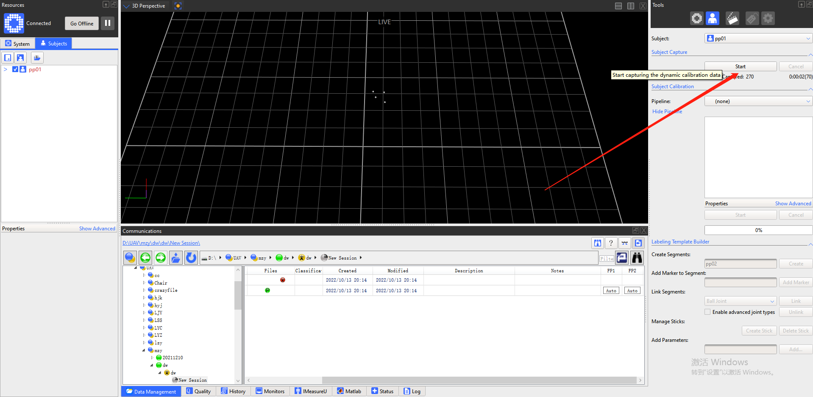

### Step 0 注意事项

- 设置右上角`View Type`为`Data Collection`

- 当这一块出现`*`时要保存

- `Trial Type` 选项选择`pose`

有时候无法capture时，可以选择**重新选择**一下`pose`(至今不知道机理是啥)

    

- 选择`kinematic fit`

- 尽量一个一个地放入被建刚体

- 记得校准`vicon`

### Step 1

新建`subject`

### Step2

捕捉图像

### Step3

重构刚体

### Step4

构建`Segments`，需要命名（与`subjects`的名字一致？）

点击一下`create`后开始构建坐标系

选择的第一个点为`origin`,

第一个点指向第二个点的向量为`z`轴负方向，可得`xy`平面

第一个点指向第三个点在`xy`平面上的投影为`y`轴正方向

`x`轴由右手螺旋法则确定

刚体构建完毕后再次点击`create`

### Step5

选择`Go Live`，确保`subjects`的名称后面没有`*`，勾选`subjects`，将刚体放入`vicon`场地，即可获得数据

